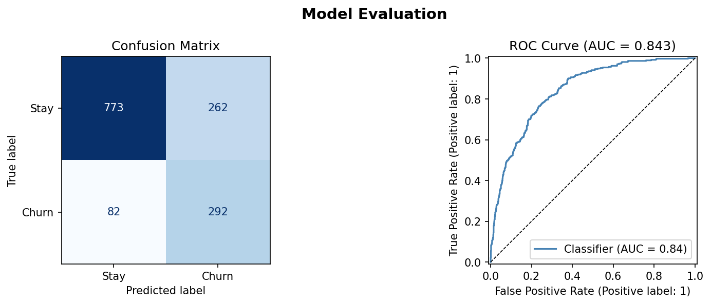
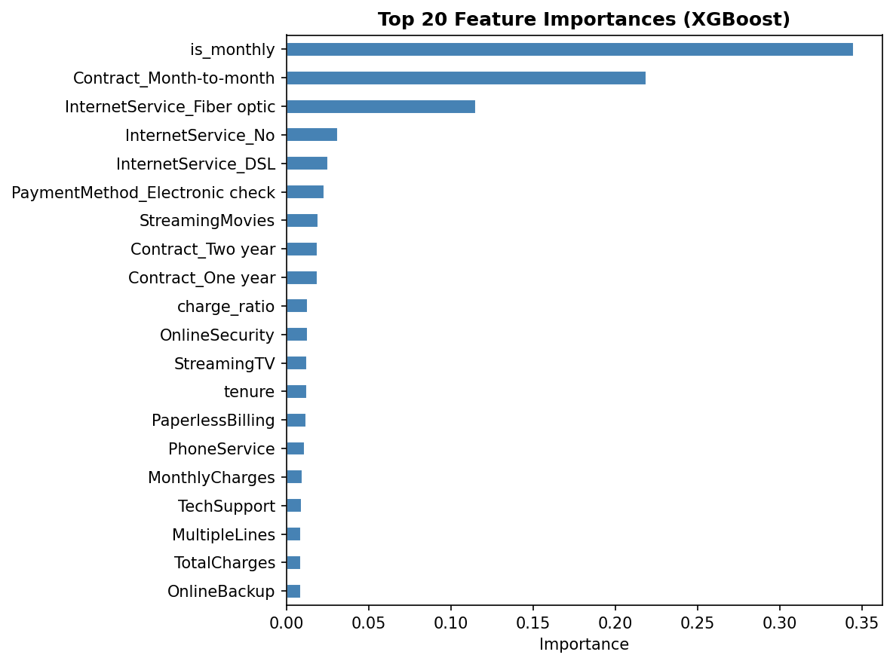
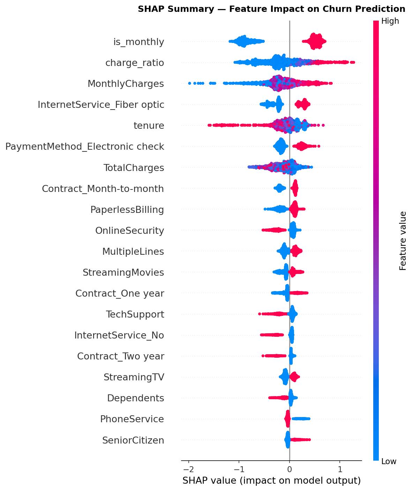
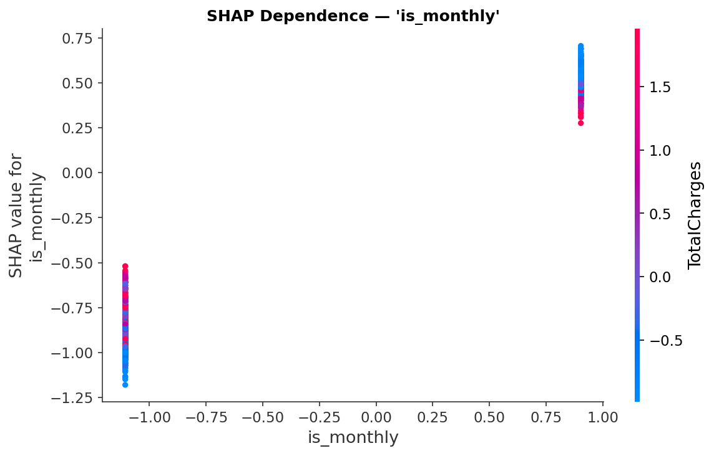

# 🚀 Customer Churn Prediction App


---

## 📌 Problem Statement

Customer churn is a major challenge for subscription-based businesses. Retaining customers is often more cost-effective than acquiring new ones.

This project predicts **whether a customer is likely to churn**, enabling businesses to take proactive retention actions.

---

## 💡 Solution Overview

This project builds an **end-to-end Machine Learning pipeline**:

* Data preprocessing & feature engineering
* Model training using **XGBoost**
* Model evaluation using ROC-AUC and confusion matrix
* Explainability using **SHAP**
* Deployment via an interactive **Streamlit app**

---

## ⚙️ Features

* 🔍 Predict churn probability
* 📊 Risk classification (Low / Medium / High)
* 🧠 SHAP-based explainability (why prediction happened)
* 📈 Visual insights (feature importance, SHAP plots)
* 🎯 Interactive UI for real-time predictions

---

## 🛠 Tech Stack

* **Python**
* **Scikit-learn**
* **XGBoost**
* **SHAP**
* **Pandas, NumPy**
* **Matplotlib, Seaborn**
* **Streamlit**

---

## 📊 Model Performance

* **ROC-AUC Score:** 0.84
* **Cross Validation:** 5-Fold
* **Class Imbalance Handling:** scale_pos_weight

---

## 📸 Screenshots

### 🔹 Model Evaluation



### 🔹 Feature Importance



### 🔹 SHAP Summary Plot



### 🔹 SHAP Dependence Plot



---

## 🧠 Model Explainability (SHAP)

* 🔴 Red → Increases churn probability
* 🔵 Blue → Decreases churn probability
* 📏 Larger values → Higher impact

This makes the model **transparent and interpretable**, not a black box.

---

## 🔍 Key Insights

* 📉 Month-to-month contracts → **highest churn risk**
* 🌐 Fiber optic users → higher churn probability
* 💰 Higher monthly charges → increased churn
* 🔒 Online security & support → reduce churn

---

## 📈 Business Recommendations

* Encourage **long-term contracts**
* Offer **discounts to high-risk customers**
* Promote **security & support services**
* Target churn-risk users with **retention campaigns**

---

## 🚀 How to Run

Clone the repository:

```bash
git clone https://github.com/sharma-manav-ms/Customer-Churn-Prediction-Project.git
cd Customer-Churn-Prediction-Project
```

Install dependencies:

```bash
pip install -r requirements.txt
```

Train the model:

```bash
python train_model_fixed.py
```

Run the app:

```bash
streamlit run app.py
```

---

## 📁 Project Structure

```
Customer-Churn-Prediction-Project/
│
├── app.py
├── train_model_fixed.py
├── model/
├── shap_plots/
├── data/
├── requirements.txt
├── README.md
```

---

## 🔮 Future Improvements

* 🌐 Deploy on Streamlit Cloud
* 📊 Add multiple model comparison
* 🎨 Improve UI/UX design
* ⚡ Real-time prediction API

---

## 👨‍💻 Author

**Manav Sharma**
Aspiring Data Scientist | Machine Learning Enthusiast

---

## ⭐ Support

If you found this project useful, give it a ⭐ and share it!
